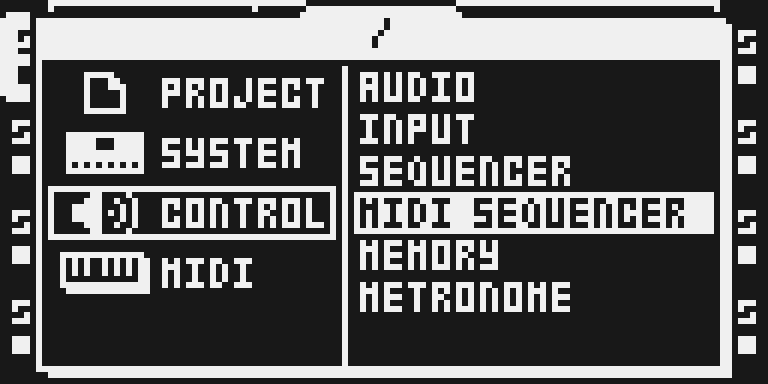
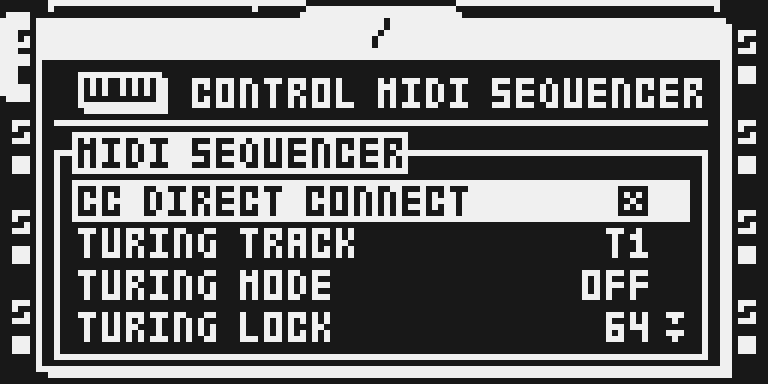
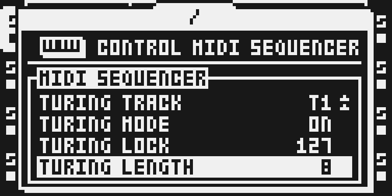

# Turing Machine

Version: 0.1.0-experimental · author: [pmsorhaindo](https://github.com/pmsorhaindo)

In progress (M2), staged in `sdk/drafts/` until it has the qualification a module folder needs. Not in
the catalog and not run on hardware. To build it, copy this folder to `sdk/octabam/modules/turing-machine/`
in a native work copy and run `make bus REMIX=<a remix with TURING MACHINE>`. The design and the plan are
in [the feasibility study](../../../docs/turing-machine-feasibility.md).

## Overview

Looping shift registers write the notes of the Octatrack's MIDI tracks, in the style of the
[Music Thing Modular Turing Machine](https://www.musicthing.co.uk/Turing-Machine/). Each MIDI track can
run its own 16-bit register. On every trig of the track it shifts once: the bit at the loop point
(LENGTH) comes back in at the bottom, inverted with a chance set by LOCK. Eight bits of the register lift
the trig 0 to 24 semitones above its own NOTE.

LOCK 127 never flips a bit, so the phrase repeats every LENGTH trigs. LOCK 64 flips about half the bits,
so the line keeps changing. LOCK 0 flips every bit, which locks a phrase twice LENGTH long whose second
half is the first inverted.

The registers have no clock of their own. They move only when the stock sequencer fires a trig, so tempo,
track speed, swing, trig conditions and note lengths stay the instrument's. A STOP and PLAY keeps every
register, so a frozen phrase survives a restart.

## Controls

PROJECT > CONTROL > MIDI SEQUENCER, under CC DIRECT CONNECT (the page shows four rows and scrolls):

| Row | Values | Default | What it does |
|---|---|---|---|
| TURING TRACK | T1..T8 | T1 | The MIDI track the three rows below edit. Not saved. |
| TURING MODE | OFF, ON | OFF | ON lets the track's register write its notes. OFF leaves the track stock. |
| TURING LOCK | 0..127 | 64 | 127: the phrase repeats. 64: random. 0: a phrase twice LENGTH, its second half inverted. |
| TURING LENGTH | 2..16 | 16 | The loop length, in trigs. Changing it keeps the register, so a shorter loop can grow back. |

RIGHT and LEFT step a row by one; LEVEL turns it faster. MODE, LOCK and LENGTH are kept per track in
battery-backed RAM: they survive a power cycle and apply to every project.

## Usage

The track's own settings still apply. NOTE is the bottom of the range, so a NOTE parameter lock moves the
range for that step. NOT2 to NOT4 move with NOTE and keep their intervals. TRAN, velocity, length, channel
and the trig pattern are unchanged.

### The first phrase after a boot

Each register is seeded once per boot, at the first trig of a Turing track. That trig fires when PLAY is
pressed, or a fixed number of steps after it, and the seed is read from a free-running hardware counter
(DMA timer 3, which stock runs at the bus clock), so the first phrase depends on the moment PLAY was hit.
Later PLAYs keep the registers.

For tests, a fixed seed can be written to battery RAM through the emulator: a 12-byte record at
`0x100ffe20`, `"TSEE"` then the seed and its complement (`turing.h`). While it is valid every boot uses that
seed; a cold initialise clears it.

### Quick tutorial

1. Press MIDI and select T1. Hold FUNC and press SRC, set CHAN to your synth's channel and press YES. Press SRC, then REC, press TRIG 1 to 16 and press REC again.
2. Press PROJ, select CONTROL and press RIGHT, select MIDI SEQUENCER and press YES. Press DOWN twice and RIGHT so TURING MODE reads ON for T1, press NO twice and press PLAY: T1 plays a line between C3 and C5.
3. Open the page again, select TURING LOCK and turn LEVEL to 127: the last 16 notes repeat. Set TURING LENGTH to 8 for a shorter loop, turn LOCK back to 64 to let the line move, or set TURING MODE to OFF to stop.

## Compatibility and limitations

Octatrack MKI or MKII on OS 1.40C. No declared conflicts. A native build beside Scale Quantizer, Euclid and
CC Map was accepted by the ledger. The rows grow the MIDI SEQUENCER page's own tables, not the SEQUENCER
page Scale Quantizer grows.

What changes in stock flows: the MIDI SEQUENCER page shows four more rows and scrolls. With every MODE OFF
the note path runs its stock instructions; MIDI OUT matched stock byte for byte in the emulator (M1).

Limitations:

- Chromatic notes only. Scale stages are planned (study, section 2.3).
- Settings are global, not saved with a project or Part; TURING TRACK resets to T1 at boot.
- The boot seed relies on DMA timer 3 counting on the unit as stock programs it (mode `0x000b`, reference `0xffffffff`). That is inferred from stock's register setup and measured in the emulator, not on hardware.
- MIDI Scenes builds only on its own, so the two cannot be combined.
- Not tested: arpeggiator, NOTE parameter locks, incoming MIDI notes, live recording, Part or pattern changes while playing, a project reload, timing under load, hardware.

## Tests and measurements

`verify.py` (`modules/turing-machine/verify.py` once copied into octabam) runs under the ColdFire port and
reads MIDI OUT. With the fixed test seed it checks every note against a model of the engine; without it,
two boots with PLAY at different moments must start different phrases. See [TESTING.md](TESTING.md).
Cycles, memory totals and hardware behaviour are not measured.

## Implementation

The note hook is the head of the stock MIDI-track chord loop at `0x4009fb2e` (study, section 7). There the
four resolved notes of a firing trig sit in a stack array before TRAN is added and the note is queued. On
chord slot 0 of a track whose MODE is ON, `tm_note` advances that track's register and moves every slot by
the same interval, dropping any note above 127. The stock note-off sends the note recorded after the hook,
so a moved note is the note released.

`turing.c` is the engine and the row getters and setters; `generate.py` compiles it to the checked-in
`turing.s`, appends `hooks.s` and refuses an instruction that both auto-modifies and addresses through one
register (GCC produced one; it wrote every byte one address high). The unit is linked into the platform
runtime in DRAM. Settings are a 32-byte checksummed record at `0x100ffe00` in battery RAM that stock never
references; an invalid record reads as every track OFF.

## Authorship and licences

Module source by [pmsorhaindo](https://github.com/pmsorhaindo) under the [MIT licence](LICENSE), built with
octabam by Sam Banks. The idea follows Tom Whitwell's Music Thing Modular Turing Machine; no code from it is
used. No Elektron firmware, extracted routines or tables are included. The thumbnail is an original
illustration.

## Screens and audio

Actual headless-emulator LCD captures of a native build of this module alone; provenance in
[media/capture.json](media/capture.json), rights in [media/LICENSE.md](media/LICENSE.md). No audio preview.

Press PROJ, select CONTROL and press RIGHT, then select MIDI SEQUENCER and press YES.

The Turing rows sit under CC DIRECT CONNECT. TURING TRACK picks the MIDI track the rows below edit; MODE
starts OFF on every track, so every track plays as stock.

T1 with MODE ON, LOCK turned to 127 with LEVEL so its phrase repeats, and LENGTH 8 for an eight-trig loop.
Set LOCK back towards 64 to let the phrase change, or MODE to OFF to stop.
