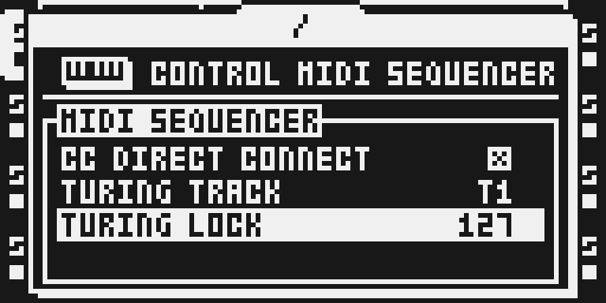

# Turing Machine

Version: 0.1.0-experimental · author: [pmsorhaindo](https://github.com/pmsorhaindo)

M1 prototype, staged in `sdk/drafts/` until it has the qualification a module folder needs (M2). Not in
the catalog and not run on hardware. To build it, copy this folder to `sdk/octabam/modules/turing-machine/`
in a native work copy and run `make bus REMIX=<a remix with TURING MACHINE>`. The design and the plan to
v0.1 are in [the feasibility study](../../../docs/turing-machine-feasibility.md).

## Overview

A looping shift register writes the notes of one Octatrack MIDI track, in the style of the
[Music Thing Modular Turing Machine](https://www.musicthing.co.uk/Turing-Machine/). A 16-bit loop
advances once per trig of the selected track. The bit leaving the top comes back in at the bottom,
inverted with a chance set by TURING LOCK. Eight bits of the loop lift the trig 0 to 24 semitones
above its own NOTE.

LOCK 127 never flips a bit, so the current 16-note phrase repeats. LOCK 64 flips about half the bits,
so the line keeps changing. LOCK 0 flips every bit, which locks a 32-step phrase whose second half is
the first inverted.

The register has no clock of its own. It moves only when the stock sequencer fires a trig on the
track, so tempo, track speed, swing, trig conditions and note lengths stay the instrument's.

## Controls

PROJECT > CONTROL > MIDI SEQUENCER, under CC DIRECT CONNECT:

| Row | Values | Default | What it does |
|---|---|---|---|
| TURING TRACK | OFF, T1..T8 | OFF | The MIDI track whose notes the register writes. OFF leaves every track stock. |
| TURING LOCK | 0..127 | 64 | 127: the phrase repeats. 64: random. 0: a 32-step phrase. |

RIGHT and LEFT step a row by one; LEVEL turns it faster. The values are kept in battery-backed RAM,
like CC DIRECT CONNECT on the same page: they survive a power cycle and apply to every project.

## Usage

The track's own settings still apply. NOTE is the bottom of the range, so a NOTE parameter lock moves
the range for that step. NOT2 to NOT4 move with NOTE and keep their intervals. TRAN, velocity, length,
channel and the trig pattern are unchanged.

### Quick tutorial

1. Press MIDI and select T1. Hold FUNC and press SRC, set CHAN to your synth's channel and press YES. Press SRC, then REC, press TRIG 1 to 16 and press REC again.
2. Press PROJ, select CONTROL and press RIGHT, select MIDI SEQUENCER and press YES. Press DOWN and RIGHT so TURING TRACK reads T1, press NO twice and press PLAY: T1 plays a line between C3 and C5.
3. Press PROJ and YES, press DOWN twice and turn LEVEL until TURING LOCK reads 127: the last 16 notes repeat. Turn it back to 64 to let the line move again, or set TURING TRACK to OFF to stop.

## Compatibility and limitations

Octatrack MKI or MKII on OS 1.40C. No declared conflicts. A native build beside Scale Quantizer,
Euclid and CC Map was accepted by the ledger. The rows grow the MIDI SEQUENCER page's own tables,
not the SEQUENCER page Scale Quantizer grows.

What changes in stock flows: the MIDI SEQUENCER page shows two more rows. With TURING TRACK OFF the
note path runs its stock instructions; MIDI OUT matched stock byte for byte in the emulator.

Limitations of this prototype:

- One track at a time, a fixed 16-step loop, chromatic notes only. Scale stages are planned (study, section 2.3).
- Settings are global, not saved with a project or Part. The register is runtime state: it restarts from the same seed after every boot, so the first phrase is always the same.
- MIDI Scenes builds only on its own, so the two cannot be combined.
- Not tested: arpeggiator, NOTE parameter locks, incoming MIDI notes, live recording, Part or pattern changes while playing, a project reload, timing under load, hardware.

## Tests and measurements

`verify.py` (`modules/turing-machine/verify.py` once copied into octabam) runs under the ColdFire port
and reads MIDI OUT. See
[TESTING.md](TESTING.md). Cycles, memory totals and hardware behaviour are not measured.

## Implementation

The note hook is the head of the stock MIDI-track chord loop at `0x4009fb2e` (study, section 7).
There the four resolved notes of a firing trig sit in a stack array before TRAN is added and the note
is queued. On chord slot 0 of the selected track, `tm_note` advances that track's register and moves
every slot by the same interval, dropping any note above 127. The stock note-off sends the note
recorded after the hook, so a moved note is the note released.

`turing.c` is the engine and the row getters and setters; `generate.py` compiles it to the checked-in
`turing.s` and appends `hooks.s`. The unit is linked into the platform runtime in DRAM.

## Authorship and licences

Module source by [pmsorhaindo](https://github.com/pmsorhaindo) under the [MIT licence](LICENSE),
built with octabam by Sam Banks. The idea follows Tom Whitwell's Music Thing Modular Turing Machine;
no code from it is used. No Elektron firmware, extracted routines or tables are included.

## Screens and audio

Actual headless-emulator LCD captures of a native build of this module alone; provenance in
[media/capture.json](media/capture.json), rights in [media/LICENSE.md](media/LICENSE.md). No audio preview.

Press PROJ, select CONTROL and press RIGHT, then select MIDI SEQUENCER and press YES.

TURING TRACK and TURING LOCK sit under CC DIRECT CONNECT. TURING TRACK starts OFF, so every MIDI track
plays as stock.

DOWN and RIGHT set TURING TRACK to T1; on TURING LOCK, LEVEL turned up to 127 makes the current
16-note phrase repeat. Turn it back to 64, or set TURING TRACK to OFF, to stop.
